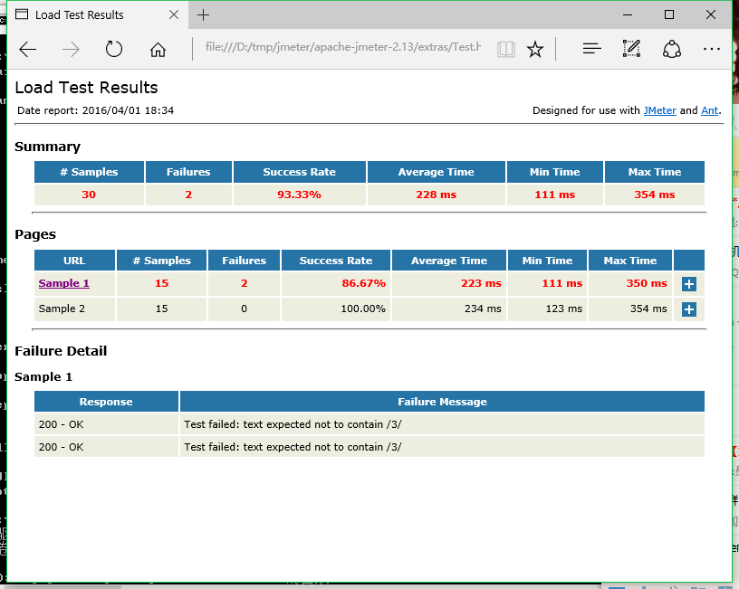

# 简单的jemeter之旅 #

## 基本目的：jekins 利用 ant 调用jemeter ##

## 基本环境 ##
--------------------
* jekins
* ant
* jmeter

## 基本原理分析 ##
--------------------
要调用就要在jekins安装的机器上也安装这个2个软件，当然ant jekins会自己下载 ，但是jmeter就不会了。我们可以自己下载到jekins安装的机器里去。
都安装好了调用逻辑就比较清晰了， jekins中在build构建步骤设置里就可以添加 ant构建器

相信用过jenkins的都知道 上图是用来构建项目的 步骤设置！
那么 ant怎么调jmeter呢？ 按照ant 基本结构是 先要有依赖jar路径；这里我们需要时候再指定就好了；然后就是ant执行文件build.xml文件？
怎么写呢？其实不用着急 ，jmeter提供我们ant调用的方法老规矩看官看下图
                
jmeter写的这build.xml文件都能干嘛？ 这应该就是我们的重点了。只有明白了这个build文件我没就能调用了jmeter了.

## jmeter/extras下build.xml ##
--------------------

先运行一把

失败了！但可以看到 一个重要的信息  指定了一个 Test.jmx 的文件。jmx文件 这个相信用过jmeter的人都知道怎么来的吧！
这个文件的位置就在extras目录下面，我们看看它写的是什么吧!

调用了java代码随便测试了一下而已。。

ok 那么接下来就是让他运行成功了！

## jmeter/extras下build.xml 成功结果 ##
---------------------
* 我的机器出现报错是我java版本过低 加载不了部分jar文件，这里我使用java7运行就没事了。
* 如果你说问我“'ant' 不是内部或外部命令，也不是可运行的程序或批处理文件。” 怎么回事？
* 答：知道环境变量path吗？jdk安装里就设置过。一样的道理 只要把path变量加一条 指向ant/bin文件夹

ok 那么结果在那里呢？成功了是成功了。这是我们可以看到当前目录下有个html文件"test.html" 是刚刚生成的吗？最后修改时间一看就知道了

我们打开看看吧!

结果已经不错的显示出来了。当然有个问题他是中文的。当然你看不习惯可以自己翻译 成中文，只要修改.xsl文件就好了,查找替换 相信你能做好。

* 如果你说问我“你怎么知道是那个.xsl文件？”
* 答：没看清楚控制台输出吗？ \[xslt\] Loading stylesheet D:\tmp\jmeter\apache-jmeter-2.13\extras\jmeter-results-detail-report_21.xsl
* 能不能其他方式显示？
* 答：可以，通过控制台输出可以看到 这html实际上也是通过 jmeter的结果文件Text.jtl文件生成的，Text.jtl就是一个xml。 xsl文件提供了转换成html文件。你可以自己进行修改或者自己写一个xsl文件，当然也可以写程序或者用其他工具进行转换html

## jmeter/extras下Text.jtl  ##
---------------------

## jmeter/extras下build.xml  ##
---------------------
接下来就是重点了！ build.xml有什么参数？ 这里都写了点什么呢？

这是jmeter提供参数的介绍，简单易懂 。

看看代码吧

	<property name="testpath" value="${user.dir}"/> 这里是指定测试文件存放的目录，默认是运行ant的目录也就是jmeter/extras/目录
    <property name="jmeter.home" value="${basedir}/.."/> 这里就是jmeter的软件目录了，默认是jmeter/extras/目录的上一级
    <property name="report.title" value="Load Test Results" />这里就是标题了。
    
    <!-- Name of test (without .jmx) -->
    <property name="test" value="Test"/> 这里指定jmx文件名称，不要后缀哦！！
    
    <!-- Should report include response data for failures? -->
    <property name="show-data" value="n"/> 这里指定jmx文件名称，不要后缀哦！！

    <property name="format" value="2.1"/> 这里指定jtl文件版本！默认是当前jmeter使用的版本. 我是jmeter-2.13那么就是说jmeter-2.13是2.1的jtl文件版本
    
    
    <condition property="style_version" value="">  这里就判断format 如果是2.0 就设置把style_version设置为""
        <equals arg1="${format}" arg2="2.0"/>
    </condition>

    <condition property="style_version" value="_21"> 这里就判断format 如果是2.1 就设置把style_version设置为"_21"
        <equals arg1="${format}" arg2="2.1"/>
    </condition>

    <condition property="funcMode"> 这里就判断show-data 如果是y 就设置把funcMode设置为有这个属性true
        <equals arg1="${show-data}" arg2="y"/>
    </condition>
    
    <condition property="funcMode" value="false">这里就判断show-data 如果不是y 就设置把funcMode设置为有这个属性false
      <not>
        <equals arg1="${show-data}" arg2="y"/>
      </not>
    </condition>
    
    
    <!-- Allow jar to be picked up locally -->
    <path id="jmeter.classpath">
        <fileset dir="${basedir}">
          <include name="ant-jmeter*.jar"/> 加入ant-jmeter*.jar （ant插件包）
        </fileset>
    </path>

    <taskdef
        name="jmeter"
        classpathref="jmeter.classpath"
        classname="org.programmerplanet.ant.taskdefs.jmeter.JMeterTask"/> jmeter ant插件定义 
`    

其实翻译代码没什么意思。后面的代码就算了吧。
最近发现一个叫“多说”的评论api。加入到我这个静态博客吧！

